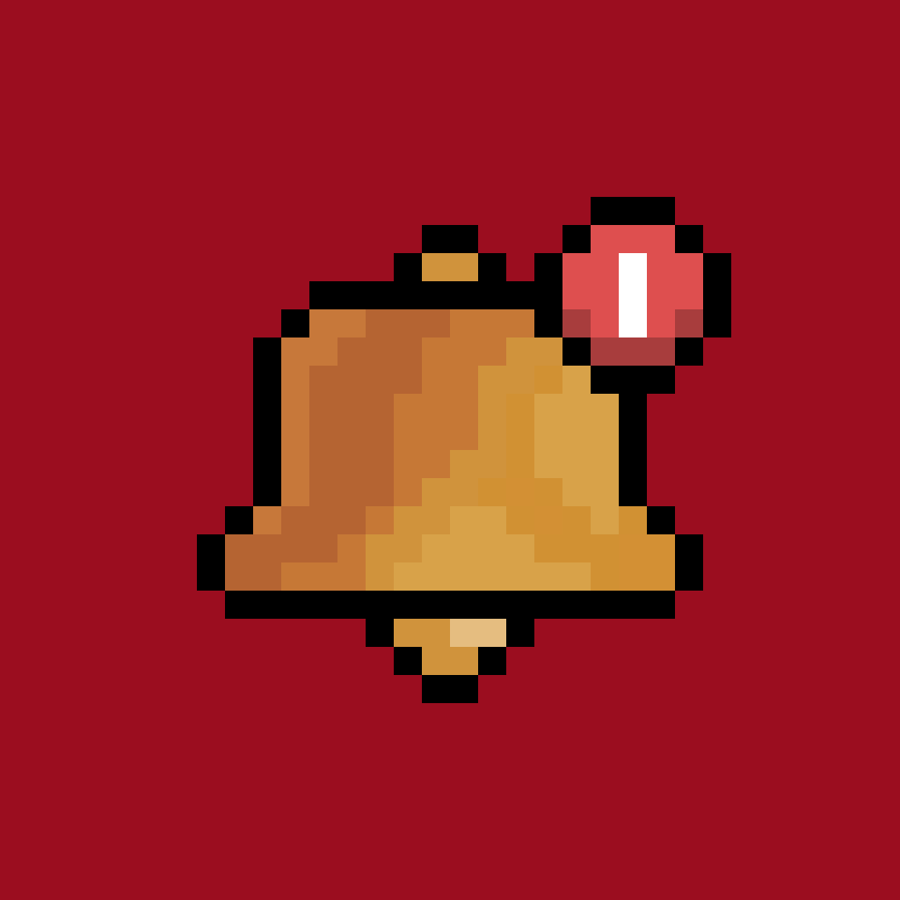

<a id="readme-top"></a>

<br/>
<br/>

<p align="center">
  
</p>
<br/>
<p align="center">
<a href="https://notificationbot.top/">Website</a> -
<a href="https://notificationbot.top/status">Status</a> -
<a href="https://notificationbot.top/docs">Documentation</a>
</p>

**Notificationbot** transforms your Discord server with a powerful, all-in-one dashboard that makes welcoming new members and managing notifications effortless and quick.

## Core Philosophy
- **Responsiveness**  
  The system reacts to external updates (e.g. YouTube uploads, Twitch goes live) in real time

- **Minimal Configuration**  
  NotificationBot favors dashboard configurations over manually executing slash commands to configure the bot

- **Extendable by Default**  
  The bot supports a growing set of third-party sources

## Structure
| Path                    | Description        |
| ----------------------- | ------------------ |
| `./api`             | API for the NotificationBot dashboard |
| `./bot`                 | Codebase for the Discord bot |
| `./web`                 | Notification bot dashboard |

---

**Fill in the environment variables before running gateway and web. All data is stored in a Postgresql database and synchronised w/ `./gateway`.**

<details>
  <summary>Table of Contents</summary>
  <ol>
    <li>
      <a href="#NotificationBot">About The Project</a>
      <ul>
        <li><a href="#built-with">Built With</a></li>
      </ul>
    </li>
    <li>
      <a href="#setup">Setup</a>
      <a href="#deploy">Deploy</a>
      <a href="#updating">Updating</a>
    </li>
    <li><a href="#contributing">Contributing</a></li>
    <li><a href="#license">License</a></li>
  </ol>
</details>

### Built With

* [![Typescript][Typescript]][Typescript-url]
* [![Next.js][Next.js]][Next-url]
* [![React.js][React.js]][React-url]

<p align="right">(<a href="#readme-top">back to top</a>)</p>

## Setup
> [!IMPORTANT]  
> Open a new issue if you find any bugs
Prerequisites: 
- Node.js @ https://nodejs.org/en/download
- npm install -g pnpm

`./api`
- cd api
- create .env
```env
# Discord stuff
DISCORD_CLIENT_ID=""
DISCORD_CLIENT_SECRET=""
DISCORD_TOKEN=""
DISCORD_ENDPOINT = "https://discord.com/api/v10"

# Database variables
DATABASE_URL="postgresql://postgres@localhost:5432/notificationbot"
REDIS_STRING="redis://default@localhost:6379"
FORCE_DB_RESET="false"

# variables to help the api and dashboard communicate
JWT_SECRET="" # openssl rand -base64 32
FRONTEND_SITE="http://localhost:3000"
PORT="3001"
API_SECRET="secret123"

YTV3API=

BLUESKY_IDENTIFIER=
BLUESKY_PASSWORD=

TWITCH_CLIENT_ID=
TWITCH_CLIENT_SECRET=
```
- pnpm install
- pnpm dev

`./bot`
- cd bot
- create .env
```env
# Discord stuff
DISCORD_TOKEN=""
GUILD_ID="" 
SUPPORT_CHANNEL_ID=""
testServer=""
clientId=""
devs=""
owner=""

# Database variables
DATABASE_URL="postgresql://postgres@localhost:5432/notificationbot"
REDIS_STRING="redis://default@localhost:6379"
FORCE_DB_RESET="false"

# variables to send http requests
API_URL="http://localhost:3001"
API_SECRET="secret123"

YTV3API=

BLUESKY_IDENTIFIER=
BLUESKY_PASSWORD=

TWITCH_CLIENT_ID=
TWITCH_CLIENT_SECRET=
```
- pnpm install
- pnpm dev

`./web`
- cd web
- create .env
```env
# Discord stuff
DISCORD_TOKEN=""
CLIENT_ID=""

# cookie domain: use base url such as example.com
NEXT_PUBLIC_COOKIE_DOMAIN="localhost"

# variables to help the api and dashboard communicate
NEXT_PUBLIC_API="http://localhost:3001"
NEXT_PUBLIC_BASE_URL="http://localhost:3000"
API_SECRET="secret123"

# github token for fetching repositories
GITHUB_TOKEN=""

# https://www.geetest.com/en/ recommended for this
NEXT_PUBLIC_CAPTCHA_ID=""
```
- pnpm install
- pnpm dev

See the [open issues](https://github.com/Decompile1/notificationbot/issues) for a full list of proposed features and known issues.

<p align="right">(<a href="#readme-top">back to top</a>)</p>

## Deploy
```
cd api
docker build -t notificationbot-api .
docker compose up -d
```
```
cd bot
docker build -t notificationbot .
docker compose up -d
```
```
cd web
docker build -t notificationbot-web .
docker compose up -d
```

```
docker pull postgres
docker volume create postgres_data
sudo docker run -d --name postgres_container -e POSTGRES_PASSWORD=hamburgers -p 5432:5432 -v postgres_data:/var/lib/postgresql/data postgres
docker ps
```

```
docker pull redis
docker run -d --name notificationbot-redis -p 6379:6379 redis
docker ps
```

## Updating
```
git reset --hard
git pull

sudo docker compose down
sudo docker image prune -a

sudo docker compose up -d --build

# dev testing
sudo docker compose build --no-cache

sudo docker compose up -d
```
use --no-cache if you are having problems

## Contributing

Contributions is what makes the open source community such an amazing place to learn, inspire, and create. Any contributions you make are **greatly appreciated**!

To contribute, please fork the repo and create a pull request. You can also simply open an issue with the tag "enhancement".
Don't forget to give the project a star!

1. Fork the Project
2. Create your Feature Branch (`git checkout -b feature/AmazingFeature`)
3. Commit your Changes (`git commit -m 'Add some AmazingFeature'`)
4. Push to the Branch (`git push origin feature/AmazingFeature`)
5. Open a Pull Request

### Top contributors:

<a href="https://github.com/Decompile1/notificationbot/graphs/contributors">
  
</a>

<p align="right">(<a href="#readme-top">back to top</a>)</p>

<!-- LICENSE -->
## License
<a href="https://www.gnu.org/licenses/gpl-3.0.en.html">
  
</a>
NotificationBot is licensed under the `GNU GENERAL PUBLIC LICENSE v3.0`. See `license.txt` for more information.

<p align="right">(<a href="#readme-top">back to top</a>)</p>

## Resources
- https://www.postgresql.org/download/macosx/
- https://postgresapp.com/
- https://redis.io/docs/latest/operate/oss_and_stack/install/install-redis/install-redis-on-mac-os/
- https://nodejs.org/en/download

<p align="right">(<a href="#readme-top">back to top</a>)</p>

## Star History

[](https://www.star-history.com/#decompile1/notificationbot&type=date&legend=top-left)

[contributors-shield]: https://img.shields.io/github/contributors/Decompile1/notificationbot.svg?style=for-the-badge
[contributors-url]: https://github.com/Decompile1/notificationbot/graphs/contributors
[forks-shield]: https://img.shields.io/github/forks/Decompile1/notificationbot.svg?style=for-the-badge
[forks-url]: https://github.com/Decompile1/notificationbot/network/members
[stars-shield]: https://img.shields.io/github/stars/Decompile1/notificationbot.svg?style=for-the-badge
[stars-url]: https://github.com/Decompile1/notificationbot/stargazers
[issues-shield]: https://img.shields.io/github/issues/Decompile1/notificationbot.svg?style=for-the-badge
[issues-url]: https://github.com/Decompile1/notificationbot/issues
[license-shield]: https://img.shields.io/github/license/Decompile1/notificationbot.svg?style=for-the-badge
[license-url]: https://github.com/Decompile1/notificationbot/blob/master/LICENSE.txt
[product-screenshot]: /screenshot.png
[Next.js]: https://img.shields.io/badge/next.js-000000?style=for-the-badge&logo=nextdotjs&logoColor=white
[Next-url]: https://nextjs.org/
[React.js]: https://img.shields.io/badge/React-20232A?style=for-the-badge&logo=react&logoColor=61DAFB
[React-url]: https://reactjs.org/
[Typescript]: https://img.shields.io/badge/Typescript-20232A?style=for-the-badge&logo=typescript&logoColor=61DAFB
[Typescript-url]: https://www.typescriptlang.org/